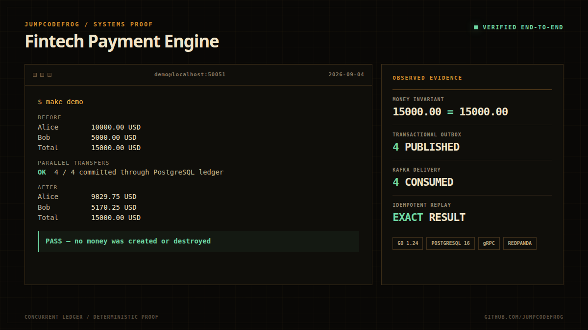
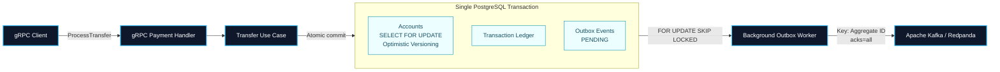

<div align="right">

[ 🇷🇺 Читать на русском ](README_RU.md)

</div>

# Fintech Payment Engine

<div align="center">

[](https://go.dev/)
[](https://www.postgresql.org/)
[](https://kafka.apache.org/)
[](https://www.docker.com/)
[](https://github.com/JumpCodeFrog/fintech-payment-engine/actions/workflows/ci.yml)

**A concurrency-safe ledger and payment engine in Go with PostgreSQL, gRPC, Transactional Outbox, idempotent replay, and Kafka.**

</div>

<p align="center">
  
</p>

`fintech-payment-engine` demonstrates how to preserve monetary invariants under concurrency while propagating payment events through a Transactional Outbox. Domain rules are isolated from PostgreSQL, Kafka, and gRPC through explicit ports; the critical paths are covered by unit tests and real PostgreSQL integration tests.

## Key Architectural Highlights

- **Concurrent Balance Safety** - transfers lock both accounts in deterministic UUID order with `SELECT ... FOR UPDATE`, then use optimistic version checks. A real PostgreSQL race test verifies that concurrent transfers never overspend and preserve the total balance.
- **Exact Money Domain** - values use `decimal.Decimal` and must be exactly representable as PostgreSQL `NUMERIC(18,4)`. Sub-scale amounts, implicit rounding, precision overflow, and target-balance overflow are rejected before commit.
- **Idempotent Transfer Replay** - an identical request returns the original transaction; the same key with a different payload is rejected. Concurrent duplicate requests commit one ledger record and one Outbox event.
- **Atomic Ledger & Outbox** - balance mutations, the transaction record, and the pending Outbox event are committed in one PostgreSQL transaction, avoiding a database/Kafka dual write.
- **At-Least-Once Event Delivery** - workers claim pending events through `FOR UPDATE SKIP LOCKED`, publish synchronously with Kafka `acks=all`, and persist retry or terminal failure state.
- **Reproducible Delivery Checks** - CI runs race-enabled unit and PostgreSQL integration tests, fixed-version linting, binary builds, and both production container builds. API and Worker images are static multi-stage builds running as UID/GID `10001`.

## Architecture



### Transfer Consistency Model

1. The use case validates account identities, currency, idempotency key, and exact `NUMERIC(18,4)` representation.
2. An exact idempotent replay returns the original transaction; a changed payload with the same key is rejected.
3. Both account UUIDs are sorted before row locking, so concurrent transfers acquire locks in one order.
4. Balance updates use `WHERE id = $1 AND version = $2`; PostgreSQL increments the version atomically.
5. The ledger record and `payment.transferred` Outbox event are inserted before commit.
6. The Worker publishes with at-least-once semantics, so consumers must deduplicate by event or transaction identity.

## Technology Stack

| Area | Technology | Role |
|---|---|---|
| Language | Go 1.24+ | Type-safe, concurrent API and background processing |
| Transport | gRPC + Protocol Buffers | Versioned, strongly typed payment API |
| Database | PostgreSQL 16 + `pgx/v5` | ACID ledger, account locks, optimistic versioning, Outbox |
| Money | `shopspring/decimal` | Exact base-10 monetary arithmetic |
| Messaging | Apache Kafka API via Redpanda + `kafka-go` | Durable event distribution with `acks=all` |
| Reliability | Transactional Outbox | Atomic database writes and reliable event propagation |
| Concurrency | `FOR UPDATE`, `SKIP LOCKED` | Double-spend prevention and horizontally scalable workers |
| Containers | Docker, Alpine Linux | Static multi-stage builds running as non-root |
| Quality | Go race detector, real PostgreSQL tests, golangci-lint, GitHub Actions | Concurrency, replay, money-domain, lint, and build gates |

## Quick Start

### Prerequisites

- Go 1.24 or newer
- Docker Engine with Docker Compose
- GNU Make

### 1. Start Infrastructure

```bash
make up
```

This starts PostgreSQL 16, Redpanda, and Redpanda Console, then creates the configured Kafka topic (`payment-events` by default). PostgreSQL executes only the mounted up migrations when its data volume is initialized.

### 2. Apply Migrations

Use this command for an existing PostgreSQL volume or after adding a new migration:

```bash
make migrate
```

The idempotent seed migration creates deterministic USD and EUR accounts for Alice and Bob without resetting existing balances.

### 3. Start the API and Outbox Worker

Open two terminals from the repository root:

```bash
go run ./cmd/api
```

```bash
KAFKA_BROKERS=localhost:19092 go run ./cmd/worker
```

The API listens on `:50051` by default. Configuration can be overridden with `POSTGRES_URL`, `KAFKA_BROKERS`, `KAFKA_TOPIC`, `GRPC_PORT`, `OUTBOX_BATCH_SIZE`, `OUTBOX_POLL_INTERVAL`, and `OUTBOX_MAX_RETRIES`.

> On Windows PowerShell, use `$env:KAFKA_BROKERS="localhost:19092"; go run ./cmd/worker`.

### 4. Run the Demo

```bash
make demo
```

### 5. Run Tests

```bash
make test-race
make test-integration
```

`make test-integration` uses the PostgreSQL started by `make up`, creates an isolated temporary schema, and verifies concurrent balance conservation, exact idempotent replay, and the `NUMERIC(18,4)` money boundary.

## Demo: Conservation of Total Balance

The demo connects to `localhost:50051`, reads the seeded USD balances, and launches concurrent transfers in both directions between Alice and Bob.

```text
Alice USD account: aaaaaaaa-aaaa-4aaa-8aaa-aaaaaaaa0001
Bob USD account:   bbbbbbbb-bbbb-4bbb-8bbb-bbbbbbbb0001
Initial total:     15,000.00 USD
```

After all RPCs finish, it reads both balances again and verifies the core ledger invariant:

```text
Alice(before) + Bob(before) == Alice(after) + Bob(after)
```

The command exits with a non-zero status if any transfer fails or if money is created or destroyed. Set `GRPC_ADDRESS` to run it against a different endpoint.

## Project Structure

```text
fintech-payment-engine/
|-- api/proto/payment/v1/          # Protobuf contract and generated gRPC code
|-- cmd/
|   |-- api/                       # gRPC API composition root
|   |-- worker/                    # Outbox Worker composition root
|   `-- demo/                      # Concurrent transfer and invariant demo
|-- internal/
|   |-- domain/                    # Entities, statuses, errors, repository ports
|   |-- usecase/                   # Framework-independent transfer orchestration
|   |-- delivery/grpc/             # Request validation and domain-to-gRPC mapping
|   |-- repository/postgres/       # pgx repositories and transaction context adapter
|   |-- integration/               # Real PostgreSQL concurrency and replay tests
|   `-- worker/                    # Transactional Outbox polling and retry policy
|-- pkg/
|   |-- config/                    # Environment-driven runtime configuration
|   `-- kafka/                     # Synchronous Kafka producer abstraction
|-- migrations/                    # Schema and deterministic seed migrations
|-- deployments/
|   |-- docker-compose.yml         # PostgreSQL, Redpanda, and Redpanda Console
|   |-- Dockerfile.api             # Non-root API image
|   `-- Dockerfile.worker          # Non-root Worker image
|-- .github/workflows/ci.yml       # Race tests, PostgreSQL integration, lint, builds
|-- Makefile                       # Local development commands
`-- go.mod                         # Go module and pinned dependencies
```

## Delivery Semantics

The Outbox Worker intentionally provides **at-least-once**, not fictional end-to-end exactly-once delivery. A Kafka publish can succeed while the subsequent PostgreSQL commit fails, causing the event to be sent again. Each message uses a stable aggregate key, and downstream consumers are expected to deduplicate by event or transaction identity.

## License

Released under the MIT License.
