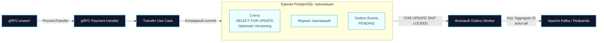

<div align="right">

[ 🇺🇸 Read in English ](README.md)

</div>

# Fintech Payment Engine

<div align="center">

[](https://go.dev/)
[](https://www.postgresql.org/)
[](https://kafka.apache.org/)
[](https://www.docker.com/)
[](https://github.com/JumpCodeFrog/fintech-payment-engine/actions/workflows/ci.yml)
[](https://go.dev/doc/articles/race_detector)
[](#архитектура)

**Высокопроизводительный отказоустойчивый распределённый ledger и платёжный движок с Transactional Outbox, сквозной идемпотентностью и gRPC.**

</div>

`fintech-payment-engine` показывает, как сохранять корректность денежных переводов при высокой конкуренции и надёжно доставлять платёжные события в Kafka. Доменная логика отделена от PostgreSQL, Kafka и gRPC явными интерфейсами, поэтому критические финансовые правила тестируются без запуска инфраструктуры.

## Ключевые Архитектурные Решения

- **Защита от двойного списания при конкуренции** - перевод блокирует оба счёта в детерминированном порядке через `SELECT ... FOR UPDATE`, применяет optimistic versioning и хранит деньги в `decimal.Decimal`, а не в `float64`.
- **Атомарность платежа и Outbox-события** - изменения балансов, ledger-транзакция и событие Outbox фиксируются одной PostgreSQL-транзакцией, устраняя проблему dual write между базой и Kafka.
- **Надёжная доставка At-Least-Once** - параллельные Worker-процессы выбирают события через `FOR UPDATE SKIP LOCKED`, публикуют их с Kafka `acks=all` и сохраняют retry либо финальный статус ошибки.
- **Чистая архитектура по построению** - use case зависит только от доменных интерфейсов; closure-паттерн `Transactor` передаёт транзакционный контекст, не раскрывая `pgx.Tx` бизнес-слою.
- **Production-grade pipeline** - CI выполняет race-тесты с coverage и lint, а API и Worker собираются в минимальные multi-stage контейнеры и запускаются под непривилегированным UID/GID `10001`.

## Архитектура



### Модель Консистентности Перевода

1. Use case проверяет сумму, идентификаторы счетов, валюту и ключ идемпотентности.
2. UUID обоих счетов сортируются перед блокировкой строк, поэтому конкурентные переводы всегда захватывают блокировки в одном порядке.
3. Балансы обновляются с условием `WHERE id = $1 AND version = $2`, а PostgreSQL атомарно увеличивает версию.
4. Ledger-запись и Outbox-событие `payment.transferred` создаются до фиксации транзакции.
5. Worker доставляет события с семантикой at-least-once, поэтому downstream consumers должны быть идемпотентными.

## Технологический Стек

| Область | Технология | Назначение |
|---|---|---|
| Язык | Go 1.24+ | Типобезопасный конкурентный API и фоновая обработка |
| Транспорт | gRPC + Protocol Buffers | Версионируемый строго типизированный платёжный API |
| База данных | PostgreSQL 16 + `pgx/v5` | ACID ledger, блокировки счетов, optimistic versioning, Outbox |
| Деньги | `shopspring/decimal` | Точная десятичная арифметика без ошибок `float64` |
| Messaging | Apache Kafka API через Redpanda + `kafka-go` | Надёжное распределение событий с `acks=all` |
| Надёжность | Transactional Outbox | Атомарная запись в БД и гарантированная публикация событий |
| Конкурентность | `FOR UPDATE`, `SKIP LOCKED` | Защита от double spending и горизонтальное масштабирование Worker |
| Контейнеры | Docker, Alpine Linux | Статические multi-stage сборки под non-root пользователем |
| Качество | Go race detector, golangci-lint, GitHub Actions | Автоматические тесты, lint, coverage и проверка сборки |

## Быстрый Старт

### Требования

- Go 1.24 или новее
- Docker Engine с Docker Compose
- GNU Make

### 1. Запуск Инфраструктуры

```bash
make up
```

Команда запускает PostgreSQL 16, Redpanda, Redpanda Console, Redis, Jaeger, Prometheus и Grafana. При первой инициализации data volume PostgreSQL автоматически выполняет подключённые миграции.

### 2. Применение Миграций

Для существующего PostgreSQL volume или после добавления новой миграции выполните:

```bash
make migrate
```

Идемпотентная seed-миграция создаёт детерминированные USD- и EUR-счета Alice и Bob, не сбрасывая существующие балансы.

### 3. Запуск API и Outbox Worker

Откройте два терминала в корне репозитория:

```bash
go run ./cmd/api
```

```bash
KAFKA_BROKERS=localhost:19092 go run ./cmd/worker
```

По умолчанию API слушает `:50051`. Конфигурация переопределяется переменными `POSTGRES_URL`, `KAFKA_BROKERS`, `KAFKA_TOPIC`, `GRPC_PORT`, `OUTBOX_BATCH_SIZE`, `OUTBOX_POLL_INTERVAL` и `OUTBOX_MAX_RETRIES`.

> В Windows PowerShell используйте `$env:KAFKA_BROKERS="localhost:19092"; go run ./cmd/worker`.

### 4. Запуск Demo

```bash
make demo
```

### 5. Race-тесты

```bash
make test-race
```

## Demo: Инвариант Сохранения Денег

Demo подключается к `localhost:50051`, читает начальные USD-балансы и параллельно запускает переводы в обоих направлениях между Alice и Bob.

```text
USD-счёт Alice:    aaaaaaaa-aaaa-4aaa-8aaa-aaaaaaaa0001
USD-счёт Bob:      bbbbbbbb-bbbb-4bbb-8bbb-bbbbbbbb0001
Начальная сумма:   15,000.00 USD
```

После завершения всех RPC demo повторно читает оба баланса и проверяет основной ledger-инвариант:

```text
Alice(до) + Bob(до) == Alice(после) + Bob(после)
```

Команда возвращает ненулевой exit code, если хотя бы один перевод завершился ошибкой или если деньги были созданы либо потеряны. Через `GRPC_ADDRESS` можно указать другой endpoint.

## Структура Проекта

```text
fintech-payment-engine/
|-- api/proto/payment/v1/          # Protobuf-контракт и сгенерированный gRPC-код
|-- cmd/
|   |-- api/                       # Composition root gRPC API
|   |-- worker/                    # Composition root Outbox Worker
|   `-- demo/                      # Параллельные переводы и проверка инварианта
|-- internal/
|   |-- domain/                    # Сущности, статусы, ошибки, repository ports
|   |-- usecase/                   # Независимая от фреймворков оркестрация перевода
|   |-- delivery/grpc/             # Валидация запросов и mapping domain -> gRPC
|   |-- repository/postgres/       # pgx-репозитории и адаптер транзакционного контекста
|   `-- worker/                    # Polling Transactional Outbox и retry policy
|-- pkg/
|   |-- config/                    # Конфигурация из переменных окружения
|   `-- kafka/                     # Абстракция синхронного Kafka producer
|-- migrations/                    # Схема БД и детерминированные seed-данные
|-- deployments/
|   |-- docker-compose.yml         # Локальный инфраструктурный стек
|   |-- Dockerfile.api             # Non-root образ API
|   |-- Dockerfile.worker          # Non-root образ Worker
|   `-- prometheus.yml             # Конфигурация Prometheus
|-- .github/workflows/ci.yml       # Тесты, race detector, lint и сборка бинарников
|-- Makefile                       # Команды локальной разработки
`-- go.mod                         # Go-модуль и закреплённые зависимости
```

## Семантика Доставки

Outbox Worker намеренно обеспечивает **at-least-once**, а не фиктивную end-to-end exactly-once доставку. Публикация в Kafka может завершиться успешно, а последующий commit в PostgreSQL - ошибкой, из-за чего событие будет отправлено повторно. Каждое сообщение использует стабильный aggregate key, а downstream consumers должны выполнять дедупликацию по идентификатору события или транзакции.

## Лицензия

Проект распространяется под лицензией MIT.
